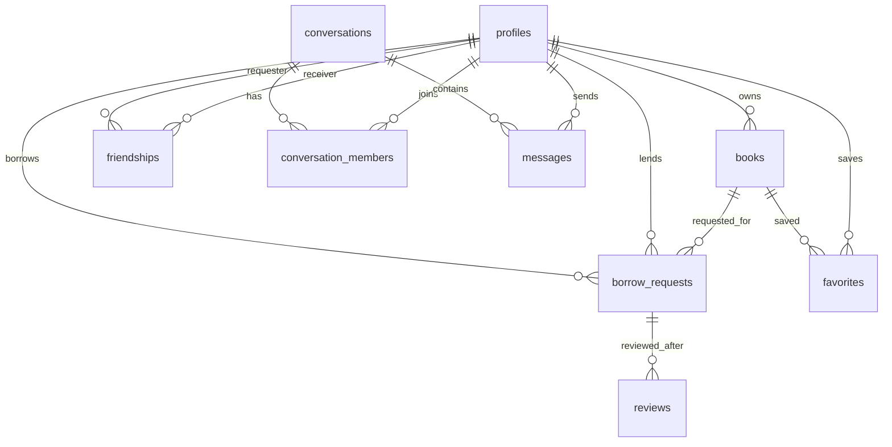

# LinkNest 数据库 Schema

第三步的数据库层由两个文件组成：

- `supabase/migrations/20260518000000_initial_schema.sql`：正式建表脚本。
- `supabase/seed.example.sql`：开发示例数据，需要替换成真实 Auth 用户 ID 后执行。

## 核心表

### profiles

用户公开资料。和 `auth.users` 一对一关联。

关键字段：

- `id`：等于 `auth.users.id`
- `display_name`
- `avatar_url`
- `bio`
- `home_lat`
- `home_lng`
- `visible_radius_km`
- `privacy_level`

### books

用户发布的可共享图书。

关键字段：

- `owner_id`
- `title`
- `author`
- `isbn`
- `cover_url`
- `description`
- `category`
- `condition`
- `status`
- `location_lat`
- `location_lng`
- `search_vector`

### borrow_requests

借阅申请和借阅状态机。

状态：

- `pending`
- `accepted`
- `borrowed`
- `return_requested`
- `returned`
- `rejected`
- `canceled`

### friendships

好友申请和好友关系。

状态：

- `pending`
- `accepted`
- `rejected`
- `blocked`

### conversations / conversation_members / messages

消息系统。第一版支持普通文本、系统消息和借阅卡片。

### favorites

用户收藏图书。

### reviews

借阅完成后的评价。

### reports

用户举报入口。可以指向用户、图书，或同时指向两者。

关键字段：

- `reporter_id`
- `reported_user_id`
- `book_id`
- `reason`
- `detail`
- `status`

## 关系图



## RLS 原则

- 图书：游客可读 `available` 图书，书主可读自己的所有图书。
- 资料：公开可读，用户只能更新自己的资料。
- 借阅：只有借阅双方可读写。
- 好友：只有关系双方可读写。
- 消息：只有会话成员可读写。
- 收藏：只有本人可读写。
- 评价：公开可读，评价人可创建。
- 举报：用户只能创建和读取自己的举报记录，后台审核使用 service role。

## 附近图书函数

`nearby_books(user_lat, user_lng, radius_km)` 会返回指定半径内的可借图书，并附带 `distance_km`。

示例：

```sql
select *
from public.nearby_books(43.6532, -79.3832, 3);
```

## 执行顺序

1. 在 Supabase 控制台创建项目。
2. 执行 `supabase/migrations/20260518000000_initial_schema.sql`。
3. 在 Auth 里创建测试用户。
4. 用测试用户的 `auth.users.id` 替换 `supabase/seed.example.sql` 里的占位 UUID。
5. 执行 `supabase/seed.example.sql`。
6. 调用 `nearby_books` 验证附近书籍查询。
